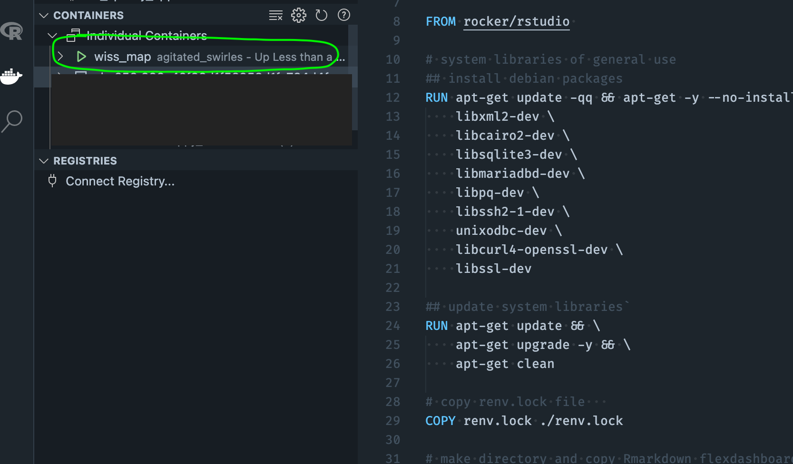

## Step 0: Requirements 

 * A shiny app, some analysis, or a report you want to publish
 * [Docker](https://www.docker.com/) installed
 * A [Dockerhub](https://hub.docker.com/) account
 * A Google account

## Step 1: Containerize Your App

#### Why containerize your app?

Containerizing bundles your app with all its dependencies, allowing you to deploy anywhere.

#### Use the following steps to build a Docker image of your app:

Once your app is finished and ready for deployment, use the `{renv}` package to create a lockfile by calling `renv::snapshot()`. A lockfile captures the state of your app's R package dependencies, so if you do any further development using additional packages make sure to run this again to update the lockfile. The lockfile will be referenced in the dockerfile to install your app's dependencies. 

Next create a `Dockerfile`, which is a text document with a set of steps that contains all the commands to build and run your app. Here's the Dockerfile I used in my Wissahickon valley explorer project, with a few things to note:

 * I'm using the `rocker/rstudio` base image
 * the lockfile is copied and all packages *and their dependencies* are installed with `renv::restore()`
 * port `3838` is used for flexdashboards while `8080` should be used for shiny apps. als note the different ways to run each type of app (`runApp` vs `run`)
 
```{docker}
# Docker file mostly comes from 
# https://www.statworx.com/at/blog/how-to-dockerize-shinyapps/ 
# and 
# https://medium.com/analytics-vidhya/deploying-a-shiny-flexdashboard-with-docker-cca338a10d12

# Base image https://hub.docker.com/u/rocker/ 
FROM rocker/rstudio 

# system libraries of general use
## install debian packages
RUN apt-get update -qq && apt-get -y --no-install-recommends install \
    libxml2-dev \
    libcairo2-dev \
    libsqlite3-dev \
    libmariadbd-dev \
    libpq-dev \
    libssh2-1-dev \
    unixodbc-dev \
    libcurl4-openssl-dev \
    libssl-dev

## update system libraries
RUN apt-get update && \
    apt-get upgrade -y && \
    apt-get clean

# copy renv.lock file   
COPY renv.lock ./renv.lock

# make directory and copy Rmarkdown flexdashboard file in it
COPY /app  ./app

# install renv & restore packages
RUN Rscript -e 'install.packages("renv")'
RUN Rscript -e 'renv::restore()'

# expose port on Docker container
EXPOSE 3838

# run shiny app as localhost and on exposed port in Docker container
# CMD ["R", "-e", "shiny::runApp('/app/wiss_map.Rmd', host = '0.0.0.0', port = 8080)"]

# run flexdashboard as localhost and on exposed port in Docker container
CMD ["R", "-e", "rmarkdown::run('/app/wiss_map.Rmd', shiny_args = list(port = 3838, host = '0.0.0.0'))"]
```

Next you'll need to build and run your image using the following commands in the terminal. I prefer to open my project folder in `VScode` and use the terminal in there.

  * First, ensure Docker is running locally
  * Then build your image using `docker build --rm --force-rm -t wiss_map . ` 
      * Here I tagged the image as `wiss_map`, you should change the tag to suit your project.
  * Then run `docker image list` to make sure you can see the newly created image
  * Finally, run your image using `docker run --rm -d -p 38:38 wiss_map` (update `wiss_map` with whatever you tagged your image is in the above step)

If everything went OK you should see the container running in the sidebar of VSCode. You can also right-click it and open in the browser.



## Step 2: Push to Dockerhub

Assuming you have an account on [Dockerhub](https://hub.docker.com/), follow these steps to push your image:

* In the terminal log into DockerHub: `docker login --username=yourhubusername` then enter your pw when prompted 
   * find the image ID: `docker images`
   * tag the image: `docker tag <IMAGE ID> yourhubusername/<image_name>:firsttry` (or whatever tag you want to use)
   * push the image to Dockerhub: `docker push yourhubusername/<image_name>`
   
Then go do Dockerhub and verify you can see your image
   
## Step 3: Deploy on Google Cloud Run

#### What is Google Cloud Run? 
Google Cloud Run is a way to deploy a containerized app serverlessly on Google cloud (serverless means you only pay for what you use). Google Cloud Run uses Google Container Registry to manage containers, so the workflow will look something like this:

finish developing app -> create dockerfile -> build image -> push image to dockerhub -> pull image from dockerhub in google cloudshell -> tag & push image to Google Container Registry -> deploy to Cloud Run

The following video will walk you through the process (or follow the some steps below):
<iframe width="560" height="315" src="https://www.youtube.com/embed/_Zul8u5YypA" title="YouTube video player" frameborder="0" allow="accelerometer; autoplay; clipboard-write; encrypted-media; gyroscope; picture-in-picture" allowfullscreen></iframe>

 * Sign into your google account, then go to https://console.cloud.google.com/ and start a new project.
 * go to container registry -> images -> new project
 * enable container registry api
 * activate cloudshell in top right - make sure you're in your newly created project
 * pull your image from Dockerhub : `docker pull user/image` (replace user with your username and image with your image)
 * check for image ID: `docker images`
 * then tag your image: `docker tag pull user/image gcr.io/{project ID}/{image tag}`
 * then push tagged image to gcr `docker push gcr.io/{project ID}/{image tag}`
     * refresh repositories to make sure it worked
  * in GCR sidebar menu go to `Cloud Run` -> create service -> select container image you just made -> change service name if needed -> set the correct container port (8080 for shiny and 3838 for flexdashboards)

## Step 3a: Deploy a new image

In the event you make revisions and want to re-deploy, use these steps:
 * revise app
 * rebuild image using step 1 above
 * push new image to dockerhub using step 2, think about tagging it `v2` or something 
 * go to Cloud Run, pull and tag the new version using steps above 
 * on the Cloud Run sidebar click on Image -> deploy new revision -> select new image in dropdown -> deploy

## Step 4 (optional): Add app as subdomain to your website
 * Cloud run on sidebar -> manage custom domains
 * add your app as sub-domain to your existing website and manage from there using the instructions


